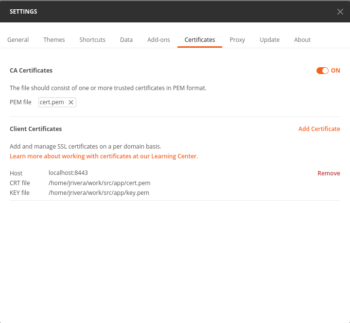

# **Build**

Inside $go-httpServer/src/app: **go build -o main .**

# **Run**

Inside $go-httpServer/src/app: **./main**

Take care of configurate your client with the certificate and key, because the server was configure to use https method. 
Inside $go-httpServer/src/app you're going to find cer.pem and key.pem, certificate and key correspondingly.
To test this app, I used postman, here is a screen-shot of my certificate configuration.

# **JSON**

This is how the json must be to send de request to the server:
**{"data": "test"}**

# **Response**
The go-httpserver is going to response with a json like this:

**{
    "code": 200,
    "message": "Success",
    "data": "oBtIaikeTQNrpF0Ag0j6NIEtbH4="
}**

# **Unit Test**

## **Execute functions unit test**

Inside $go-httpServer/src/app/functions: **go test -v --cover**

## **Execute handlers unit test**

Inside $go-httpServer/src/app/handlers: **go test -v --cover**

